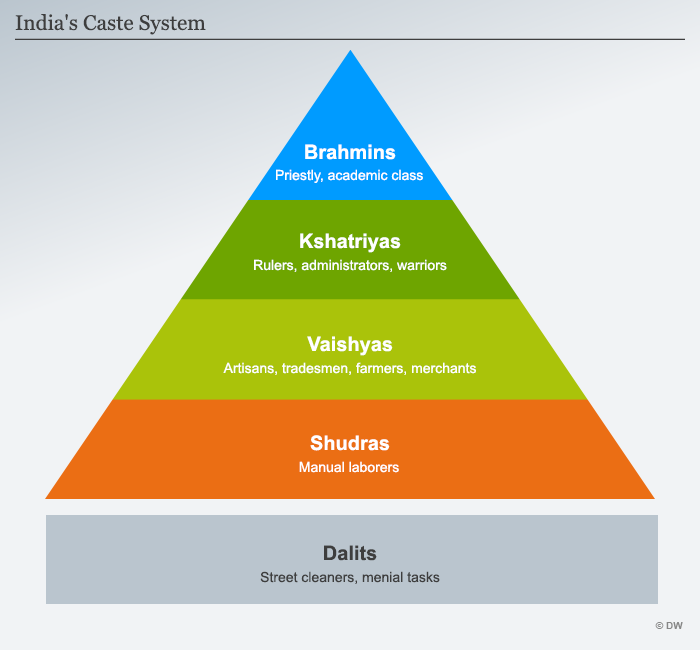

# Brahmin **婆罗门**

**英/ ˈbrɑːmɪn /美/ ˈbrɑːmɪn /**

- *n.***婆罗门**

# **Kshatriya**

**/ 'kʃɑ:trijə / （印）刹帝利（姓氏）**

# Vaishya

**美/ ˈvaɪʃə; ˈvaɪʃjə /**

- *n.***吠舍（印度封建种姓制度的四种姓的第三等级，即平民）**

Sudra，Shudra

**首陀罗（印度种姓等级中的最低等级）**

**the lowest of the four varnas: the servants and workers of low status**

# pariah

**英/ pəˈraɪə /美/ pəˈraɪə /**

- *n.***贱民（印度的最下阶级）**

Un-touchable

不入流的“贱民”

# Dalits

最低层的达立特人

# aryan

**英/ ˈeəriən /美/ ˈeriən /**

- *n.***（Aryan）雅利安人；雅利安语；讲印欧系语言的人；（纳粹意识形态中的）非犹太民族的白种人**
- *adj.***（Aryan）雅利安人的；雅利安语系的；印欧语系的；非犹太血统的白种人的**

首先来澄清一下许多人对种姓制度（Caste）普遍存在的误解。众所周知的印度种姓制度虽然最早跟人种、肤色（Varna）有关，种姓（caste）中的不同阶级叫做Varna，但发展到后期主要是按照职业（Jati）划分的，与肤色并没有绝对联系。**前者是阶级种姓**，分婆罗门（Brahmins）、刹帝利（Kshatriyas）、吠舍（Vaishyas）、首陀罗（Shudras）、贱民（Dalits）五大类；**后者是职业种姓**，比我们百家姓还多，有上千种，而且南北印度有着不同的职业种姓系统。

Hindu Caste system

# **menial   英 [ˈmiːniəl]  美 [ˈmiːniəl]**

- adj. 卑微的；仆人的；适合仆人做的
- n. 仆人；住家佣工；下贱的人

1. **"Men"**: Root from Latin "mēnialis," referring to household.
2. **Suffix "-ial"**: Used to form adjectives meaning "of or relating to."

Thus, "menial" essentially pertains to duties or work associated with household service.
